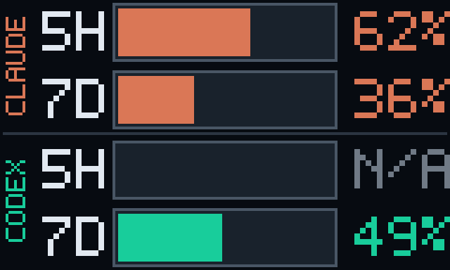
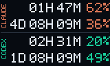

# TH99 Pro live usage display

Show your **Claude and Codex subscription capacity remaining** — the 5-hour and 7-day
windows — right on the little TFT screen of an **Epomaker TH99 Pro** keyboard.

It uses the keyboard's *existing* USB protocol, so there is **no firmware
modification or reflashing**. It reads your usage on a schedule, draws a small
status image, and uploads it only when the selected layout or normalized whole-number provider values change.

<p align="center">
  
  &nbsp;&nbsp;&nbsp;&nbsp;&nbsp;&nbsp;&nbsp;&nbsp;
  
</p>

**Two layouts.** A **Progress Bar** view to visualize 5H/7D capacity remaining. A **Reset
Timer** view to show each available reset time as `0D 03H 09M` beside the same remaining
percentage; unavailable windows remain `N/A`.

**Quota availability.** A row shows `N/A` when a provider successfully returns
no recognized 5-hour or 7-day window; `N/A` is not zero usage. Codex's 5-hour
window is currently absent from the account data returned to this app, so that
row shows `N/A`. If OpenAI restores or returns the window, the existing code
will read and display it automatically — no reconfiguration is required.

**Windows only.** This project depends on Windows-specific facilities (USB-HID
via `kernel32`, the registry via `winreg`, `os.startfile`) and PowerShell. It
will not run on macOS or Linux without a port.

---

## IMPORTANT: Read This

> **TH99 Pro only.** The screen-upload protocol in this repository has been
> confirmed only for the wired TH99 Pro. Do **not** point this uploader at another
> Epomaker keyboard merely by changing its USB ID, report size, or screen
> resolution. To adapt it, first capture that model's official driver's screen
> upload, identify and validate its HID interface, packet/container format, and
> acknowledgements, then implement a separate transport. See
> [how this was built](docs/HOW_THIS_WAS_BUILT.md) for the investigation workflow.

> **Warranty risk.** This is third-party software that uses an undocumented
> keyboard protocol; it is not represented as an Epomaker-authorized tool.
> Epomaker's published terms say its warranty ceases for software modifications
> it has not authorized. Although this project does not alter firmware, treat
> using it as a warranty risk and seek Epomaker's written approval first if
> preserving warranty coverage matters to you. [Review Epomaker's warranty
> terms](https://epomaker.com/pages/terms-of-service/1000); consumer protections
> can vary by jurisdiction.

> **Flash wear.** The display storage has finite program/erase endurance; this app attempts to minimize unnecessary writes while still providing useful display updates. Read [Safety and screen-write endurance](#safety-and-screen-write-endurance) before choosing a screen-update interval.

---

## Safety and screen-write endurance

No firmware is compiled, modified, extracted, or flashed: uploads use only the
confirmed display interface, and a live upload requires the explicit
acknowledgement phrase shown below. Each update sends a full 64 KB image
container. A teardown identifies the keyboard's onboard SPI flash, so this app
uses a conservative flash-write budget even though the protocol does not expose
where an uploaded image is committed or provide a read-back command.

Each full upload is a 64 KB image container. Based on the identified Puya
PY25Q128HA's rated endurance of 100,000 program/erase cycles per erase block,
treat each changed image conservatively as consuming one of roughly 100,000
available screen writes. The app protects that budget by skipping unchanged
display values and by limiting screen-update intervals to 5, 10, 15, 30, or 60
minutes. The default screen-update limit is 15 minutes. A detected keyboard
disconnect is a deliberate exception: because the keyboard returns to its
native screen after power loss, the running watcher performs one recovery
upload when its display interface returns, even if the usage values are
unchanged and the usual interval has not elapsed.

The **worst-case** column assumes every eligible interval produces a different
image — effectively continuous usage. The second column is an **example**, not
a prediction: it assumes only 50% of eligible screen-update intervals produce a
changed displayed value, so it halves the assumed write rate. It is not literally
"50% of time spent coding"; rounded percentages can remain unchanged while
coding, and other activity can still change a displayed value:

<table>
  <thead>
    <tr>
      <th>Screen-update interval</th>
      <th colspan="2">Lifetime to 100,000 writes</th>
    </tr>
    <tr>
      <th></th>
      <th>Worst-case</th>
      <th>50% changed intervals</th>
    </tr>
  </thead>
  <tbody>
    <tr>
      <td>5 minutes</td>
      <td>~1.0 year</td>
      <td>~1.9 years</td>
    </tr>
    <tr>
      <td>10 minutes</td>
      <td>~1.9 years</td>
      <td>~3.8 years</td>
    </tr>
    <tr>
      <td>15 minutes</td>
      <td>~2.9 years</td>
      <td>~5.7 years</td>
    </tr>
    <tr>
      <td>30 minutes</td>
      <td>~5.7 years</td>
      <td>~11.4 years</td>
    </tr>
    <tr>
      <td>60 minutes</td>
      <td>~11.4 years</td>
      <td>~22.8 years*</td>
    </tr>
  </tbody>
</table>

### How the change-skip guard works

After each successful provider poll, the app normalizes the four provider utilization values into a tuple:
`(Claude 5H, Claude 7D, Codex 5H, Codex 7D)`. Each raw provider utilization is
**rounded down** before entering that tuple; for example, 0.1% and 0.9% both
remain 0%, and it becomes 1% only at 1.0%. The display then renders the
complement as capacity remaining (100%, 99%, and so on). An unavailable window is
`N/A`.

The screen-write guard is the selected layout plus that four-value tuple; timer
countdown values are deliberately excluded. Including the countdown would make
its regular changes eligible for additional TFT uploads and, under this project's
conservative model, more flash wear. The **Reset Timer** layout shows the time
remaining until each provider's reported
reset. It formats that time only after the same layout/usage guard authorizes a
new image; countdown changes are deliberately **excluded** from the TFT write
decision. A new screen uploads only when:

1. The selected layout or newly polled usage tuple differs from the last
   successfully uploaded state.
2. The chosen screen-update interval has elapsed since the last upload.

After a detected keyboard disconnect, the app deliberately invalidates that
remembered state and performs one recovery upload once the wired `MI_03`
interface returns. This restores the custom screen after a cold boot, but may
consume one additional conservative flash-write budget entry. If that recovery
transfer itself fails, later recovery attempts remain rate-limited by the chosen
screen-update interval. The polling-based check can only observe a disconnect
that lasts until a usage poll; if a very brief unplug/replug happens entirely
between polls, stop and start tracking to request a fresh upload.

The renderer is deterministic, so an identical layout and usage tuple produces
identical pixels and the same upload payload. Frame and payload SHA-256 values
are logged for verification, but the skip decision is the layout/tuple
comparison—not a hash check. The remembered state is not persisted across a
restart, so the first successful live cycle after starting tracking uploads once
even if the values have not changed since the previous session.

These are estimates rather than a guarantee. Actual lifetime should often be
longer because integer usage percentages may not change during every active
interval, but restarting tracking after a cold boot can add an upload. The
22.8-year figure is only program/erase-cycle arithmetic; it exceeds the flash
datasheet's 20-year data-retention rating and is not a hardware-longevity
promise. Use a shorter interval only if you accept a proportionally shorter
flash lifetime; do not bypass the change-skip safeguard. See the full
[flash-wear budget](docs/TFT_PROTOCOL.md).
**Cold-boot behavior (observed):** after the keyboard loses power, it returns to
its native clock/status screen rather than automatically restoring the uploaded
usage display. This is a convenient way to leave the custom display without a
factory reset. It does not establish whether the uploaded bytes remain in flash;
only that the firmware does not select that display mode after boot. If the
watcher observes the disconnect, it uploads the current usage screen once after
the keyboard reconnects; otherwise, stop and start tracking to do so.

---

## How it works (30-second version)

```
provider utilization %  ─►  draw a fixed 160×96 image  ─►  convert to the keyboard's
(Claude+Codex)    (shows capacity remaining;         screen format  ─►  upload
                   numbers ⇒ same pixels)            over USB (only if changed)
```

The app checks the providers every one or two minutes (two minutes by default),
then, only when the selected layout or one of its normalized whole-number provider
utilization values changes, programmatically generates this image and sends it
to the keyboard's TFT at a selected 5-, 10-, 15-, 30-, or 60-minute update
interval (15 minutes by default). In Reset Timer view, the time in that image is
the remaining time until reset; the countdown itself never triggers a TFT write
or an extra image render. The usage checks are read-only; the separate
screen-update limit is what protects the keyboard's flash-write budget. The reason
for that lower bound is explained above.

The renderer is deterministic — there's no AI/generative step in the image, so
the same numbers always produce exactly the same picture.

---

## Before you start (requirements)

You'll need all of these:

1. **Windows 10 or 11.**
2. **Python 3.12+** on your `PATH` (the examples use the `py` launcher).
3. **An Epomaker TH99 Pro connected by USB cable.** Any data USB cable/port works
   — the app finds the keyboard by its USB identity, not by which port it's in.
   It must be **wired**, though: over 2.4 GHz/Bluetooth the keyboard doesn't
   expose the screen, so upload only works over the cable.
4. **Optional but recommended: get familiar with Epomaker's web driver.** If your
   keyboard is new, visit [Epomaker's web driver](https://epomaker.driveall.cn/)
   (the manual also includes access instructions) and explore a few settings so
   you can see how configuration changes behave. If it does not connect on the
   first attempt, reload the page and wait for the browser's keyboard-access
   permission prompt; Chrome worked in testing. This project uses the same
   observed communication protocol to update the TFT, but operates standalone —
   it does not require the web driver to be open or installed.
5. **The Claude Code CLI, installed and logged in** — this provides your Claude
   usage (see *How it authenticates* below).
6. **The Codex CLI, installed and logged in** — this provides your Codex usage.

Both CLI sign-ins are currently required for a live display refresh. `N/A` means
a provider successfully returned without a recognized 5-hour or 7-day window; a
provider request or sign-in failure is reported as an error and leaves the current
screen unchanged.

---

## How it authenticates (no keys are stored in this repo)

**This project stores no passwords, tokens, or API keys — none ship in the code,
and none are written into the repo.** It reuses the credentials the official CLIs
already created on your machine:

- **Claude** — read from `~/.claude/.credentials.json`, the file the Claude Code
  CLI creates when you log in. The app reads it, calls Anthropic's usage
  endpoint, and (when the token is near expiry) refreshes it *in place* the same
  way Claude Code does. That file lives **outside this repo** and is gitignored;
  it is never copied in, printed, or logged.
- **Codex** — read from your logged-in **Codex CLI**, which the app launches
  locally in read-only mode to ask for your rate-limit windows.

The only OAuth constant in the source (`claude_oauth_refresh.py`) is Claude
Code's **public** client ID — the same value shipped inside every Claude Code
install. It identifies the *application*, not you, and is not a secret. Your
personal tokens are never part of it.

---

## Windows Install

From the repo root, in PowerShell:

```powershell
py -m pip install -r requirements.txt
```

(Just two dependencies: Pillow for drawing, pystray for the tray icon.)

---

## First run — start safe, then go live

Work through these in order. The first two never touch the keyboard, so they're a
safe way to confirm your usage is being read correctly before anything is
uploaded.

**1. Check that your usage reads correctly (no keyboard access at all):**

```powershell
python src/provider_usage_probe.py
```

**2. Preview the exact image that would be shown (still no keyboard access):**

```powershell
# Renders assets/th99-live-usage-current.bmp and opens it — nothing is uploaded.
python src/th99_live_usage.py
```

**3. Do a one-time live upload to the screen.**
Plug the keyboard in by cable and **close the Epomaker web driver** first (only
one program can drive the screen at a time). The long `--acknowledge` phrase is a
deliberate safety catch so an upload can never happen by accident:

```powershell
python src/th99_live_usage.py --execute-upload --acknowledge UPLOAD_LIVE_USAGE
```

**4. Keep it updating automatically.** The easiest way is the **system-tray
switch** — a small icon (green = running and keyboard available, amber =
running while the keyboard reconnects, grey = stopped). Right-click it to
Start/Stop, choose **Progress Bar** or **Reset Timer**, choose a one- or
two-minute usage-check frequency (two minutes by default) and a minimum
screen-update interval (15 minutes by default), toggle *Run at startup*,
sync the keyboard's native clock, see the latest values, or open the preview.
When stopping, the menu shows **Stopping...** while any in-flight provider
request exits; wait for **Start tracking** before restarting.
Clock sync is a single, captured config command: it requires the keyboard to be
wired and the web driver to be closed, but does not upload the
TFT image or consume the screen-write budget:

```powershell
python src/th99_tray_app.py
```

Prefer a plain terminal loop instead of the tray? Use the watcher directly (it
uploads only when a whole-number usage value or the chosen layout changes):

```powershell
python src/th99_live_usage.py --execute-upload --acknowledge UPLOAD_LIVE_USAGE --watch
```

### Why the update interval has a floor

The screen image is stored in the keyboard's flash memory, which has a finite
number of write cycles. The app therefore **only uploads when a displayed
whole-number usage value or layout changed** — never merely because a reset
countdown advanced — and enforces a five-minute minimum interval
(5/10/15/30/60-minute presets; 15 minutes by default). See the flash-wear budget in
[docs/TFT_PROTOCOL.md](docs/TFT_PROTOCOL.md).

---

## Tests

```powershell
$env:PYTHONPATH="src"; python -m unittest discover -s tests -p "test_*.py"
```

Some tests use local USB captures that aren't published; those tests **skip
automatically** on a fresh clone rather than fail.

---

## Repository layout

- `src/` — the live pipeline (usage probes, renderer, TFT container/transport,
  OAuth refresh, and a separate keymap-restore tool)
- `tests/` — offline regression tests
- `data/captures/`, `data/keymaps/` — USB captures and keymap backups
  *(local-only, not published; tests skip without them)*
- `assets/` — generated preview images and screen-format blobs
- `schemas/` — Codex app-server JSON schemas (reference)
- `docs/` — protocol notes and per-utility READMEs (how the current pipeline works)

## Learn more

- **[CLAUDE.md](CLAUDE.md)** — the full guide: architecture, run modes, the
  Claude OAuth refresh design, confirmed protocol facts, and safety boundaries.
  (Coding agents should start here; `AGENTS.md` points to it.)
- **[docs/HOW_THIS_WAS_BUILT.md](docs/HOW_THIS_WAS_BUILT.md)** — how it was
  reverse-engineered: the packet-discovery tools (USBPcap/Wireshark), what each
  capture proved, and the external sources used. **Start here if you want to
  adapt this to another keyboard.**
- **[docs/TFT_PROTOCOL.md](docs/TFT_PROTOCOL.md)** — the TH99 Pro screen
  protocol and the flash-wear budget.
- **[docs/CONFIG_PROTOCOL_CLOCK.md](docs/CONFIG_PROTOCOL_CLOCK.md)** — the
  `MI_02` config channel and the set-clock command (`0x34`).

## Sources & attribution

This project builds on independent work — see
[docs/HOW_THIS_WAS_BUILT.md](docs/HOW_THIS_WAS_BUILT.md) for the full detail:

- **Protocol** — reverse-engineered from USB captures of Epomaker's official web
  driver, taken with [USBPcap](https://desowin.org/usbpcap/) +
  [Wireshark](https://www.wireshark.org/) and decoded by the parsers in `src/`.
- **Hardware & the update-interval floor** — the TH99 Pro
  [teardown by Gough Lui](https://goughlui.com/2026/05/05/review-teardown-epomaker-th99-pro-usb-2-4g-bt5-0-hot-swap-96-keyboard-w-lcd-knob-rgb-leds/)
  identified the **Puya PY25Q128HA** SPI flash; its [datasheet](https://www.puyasemi.com/download_path/%E6%95%B0%E6%8D%AE%E6%89%8B%E5%86%8C/Flash%20%E8%8A%AF%E7%89%87/PY25Q128HA_Datasheet_V1.9.pdf) endurance
  (100k write cycles per 4 KB sector) sizes the flash-wear budget.
- **Usage polling** — inspired by the polling approaches in
  [CodexBar by Peter Steinberger](https://github.com/steipete/CodexBar) (MIT):
  this project reads Codex through the local `codex app-server` and Claude
  through the Claude Code OAuth usage endpoint.
